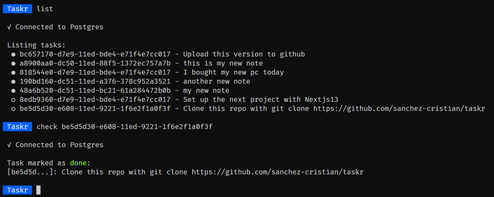

# Taskr

Taskr is a simple task manager written in Node. It is designed to be used in the terminal.
The tasks are stored on a postgres database instance. The database connection is handled by the [pg](https://www.npmjs.com/package/pg) package.